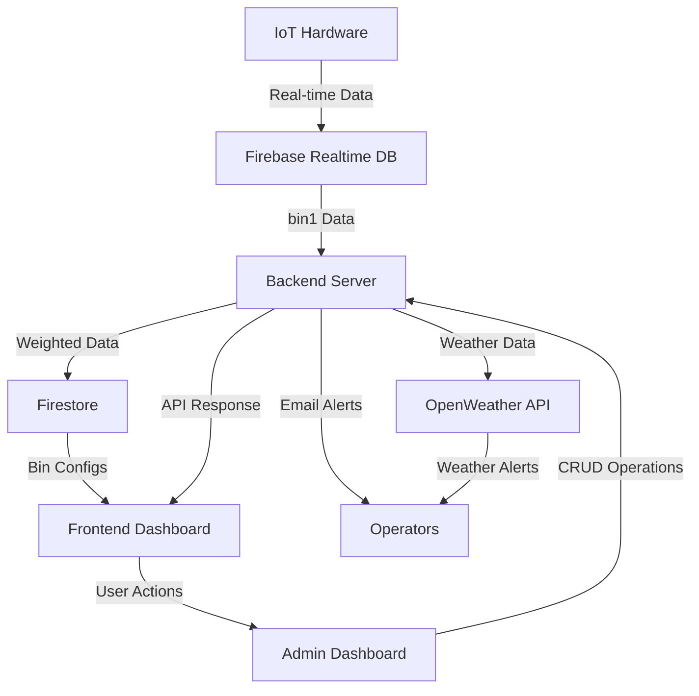
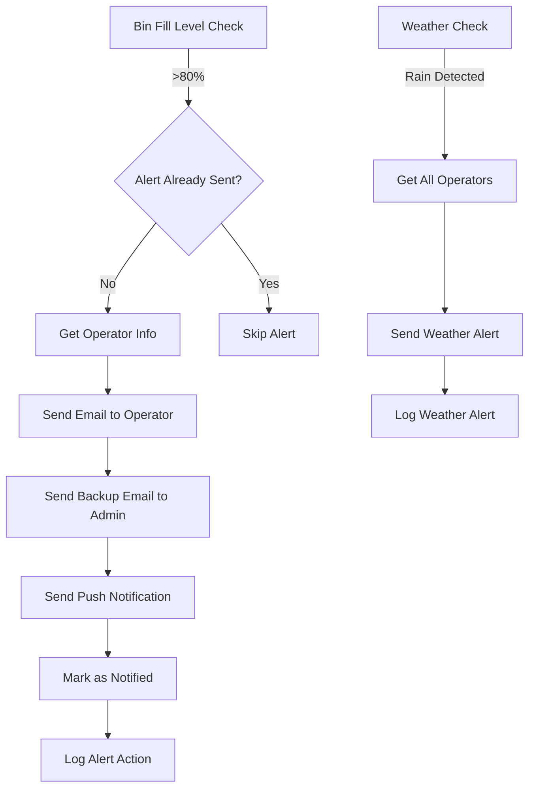
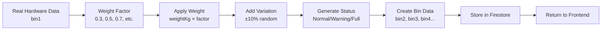
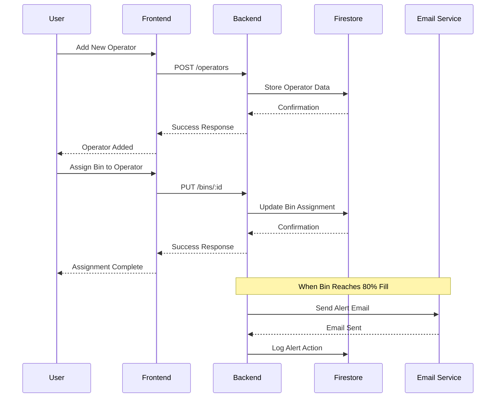
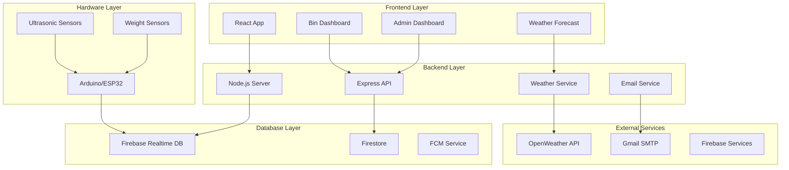
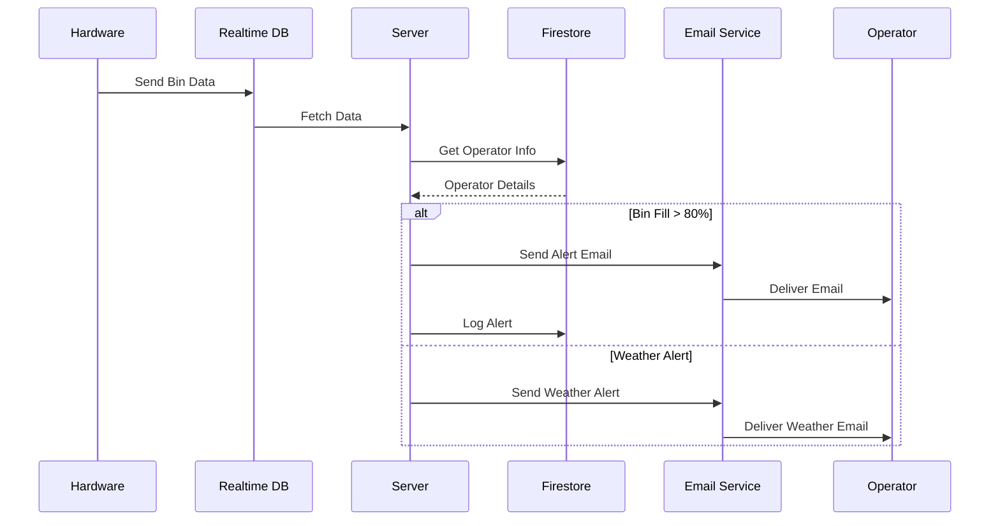
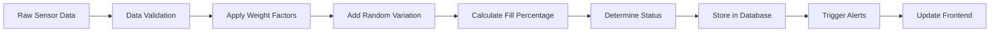

# AISWO System Architecture Diagrams

## Data Flow Architecture

## Alert System Workflow

## Weighted Data Generation Process

## User Management Workflow

## System Components Overview

## Email Notification Flow

## Data Processing Pipeline

